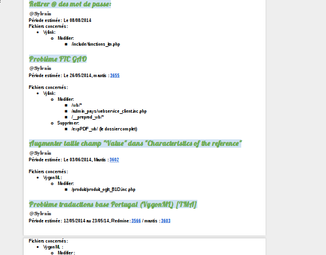
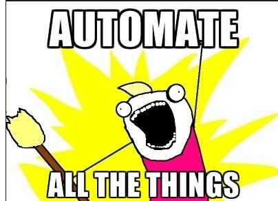
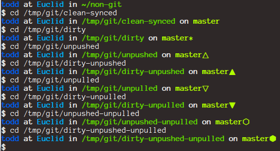
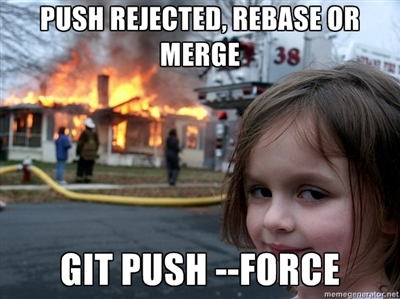
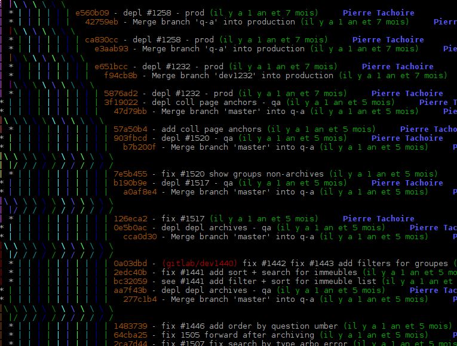
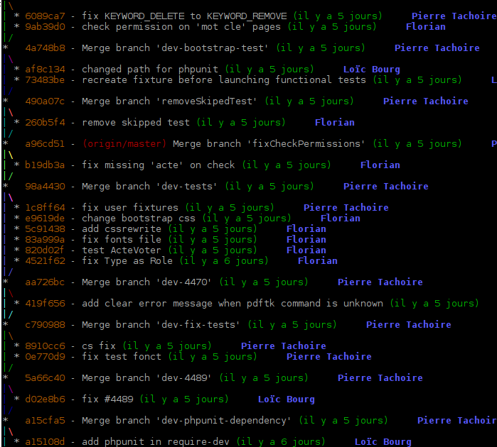

<!-- 
Titre : de rien à git
Date : 14/11/2014
Événement : Workshop git 
Auteur : Pierre Tachoire
-->

#### Retour d'experience : git en entreprise
# De rien à git

----

## Pierre Tachoire

Développeur web chez [ITNetwork](http://itnetwork.fr)

[@krichprollsch](https://twitter.com/krichprollsch)

----

## Contexte

---

* Fondée en 1996
* Agence web devenue SSII

---

* ~15 salariés
* 7 développeurs
* 2 intégrateurs
* 1 admin système

---

### Dont 6 développeurs sous windows.

----

## Une vie avant git ?

---

* mode `web agency`
* combo `ftp` + edition en `prod`

 

<small>http://kief.com/images/rice_paddy_plow.jpg</small>

---

### on est réactifs

---

* 1 développeur par projet
* chacun code dans son coin
* chacun avec ses techniques, son style

 

<small>http://allergicpet.files.wordpress.com/2014/02/kitten-sad-alone-cute-cat.jpg</small>

---

* deploiements manuels
* pas d'annulation possible
* accès aux espaces web/bdd dispersés 

 

<small>https://lh5.googleusercontent.com/-mJevSsgoCwg/UjqPjg0MXuI/AAAAAAAAApg/3a9o8x8EbK0/w700-h514-no/walk-on-wire-stunts-in-yosemite-national-park-1.png</small>

---

## ça passe encore.

---

## On signe un plus gros projet ?

---

On va développer en équipe, ça ira plus vite

 

<small>http://midpointwealth.com.au/wp-content/uploads/2013/08/business-team.jpg</small>
---

* Création d'un espace de dev "commun" sur un serveur
* Comment on règle les conflits ?

---

> - je fais le module de gestion des users tu t'occupes des documents
> - pourquoi tu as touché à ce fichier ?
> - qui à écrasé mes 2 semaines de travail ?

 

<small>http://funs.co/wp-content/uploads/2014/07/Accident9.jpg</small>
---

## On a trouvé une solution ultime

---

---

----

# Git ?

---

* Robuste
* Libre
* Bien documenté

---

### Sexy

---

## Automatiser les déploiements
---

* à la demande du dev
* environnements de dev, de test, de recette, de prod
* injection de conf 

 

<small>http://1.bp.blogspot.com/-EcZSy1ZlwX8/Ucs0IXaKmjI/AAAAAAAAAYY/czCHexHzjAs/s1600/Capture.JPG</small>
---
 
### ne plus *JAMAIS* avoir accès à la prod

---

### `Git` : la pierre angulaire du process

----

## Projet pilote

---

* 1 seul développeur pilote
* mise en place des deploiements avec l'admin sys

 

<small>http://mathandreadinghelp.org/cimages/multimages/26/science-lab-boy-experiment.jpg</small>
---

### Objectifs

* préparer les choses en amont pour éviter les blocages des
projets
* pouvoir faire le support en interne en ayant de l'avance sur l'apprentissage
* sans pour autant maîtriser tout git

----

## Formation

---

* une formation est nécessaire
* formation avec la ligne de commande
* liste de logiciels graphiques

---

> - c'est rigolo ta ligne de commande...
> - mais j'installe quoi comme logiciel ?

 

<small>http://images.learningresources.co.uk/images/products/en_us/detail/LER_9230_Tool_Set_dt.jpg</small>
----

## Généralisation

---

### Ne pas mettre la pression sur les développeurs

---

* utilisation sur les nouveaux projets uniquement
* puis généralisation sur les anciens petit à petit

 

<small>http://cdn3.volusion.com/u47ok.bmqn6/v/vspfiles/photos/P-2113-2.jpg?1337080078</small>

----

## Les premiers pas avec git

---

`git commit -am 'woot \o/'`

 

<small>http://pulsosocial.com/en/wp-content/uploads/2013/09/excited.jpg</small>

---

### On ne se préoccupe ni de workflow ni de l'historique.

----

## Deploiements
---

### On garde la réactivité.

* ce sont les développeurs qui déploient.
* indépendants de l'admin sys.

---

### Introduction de qualité 

* pas de deploiement si les testent échouent
* système de migration de bdd

---

<small>http://cdn3.raywenderlich.com/wp-content/uploads/2012/09/Rage-well-done.png</small>

----

## Les branches

---

### Expliquer la puissance des branches et l'utilité de switcher.

---

* on ne mélange plus son travail
* une tâche par branche
* on peut faire des essais et se tromper
* on fait des petits commits
* on peut la partager

---

<small>http://www.mememaker.net/static/images/memes/3838679.jpg</small>

----

## Premier workflow

---

[A successful Git branching model](http://nvie.com/posts/a-successful-git-branching-model/)

---

* une branche `master` de référence : le développement le plus avancé
* une branche par fonctionnalité qui est mergée dans `master`
* une branche de `qa` pour deploiement en test
* une branche de `production`
* une branche `hotfix` dérivant de production

---

`git merge --no-ff`

* Fusion dans master en creant un commit de merge
* Permettre de mieux suivre l'historique des branches dans `master`.

---

Récupération des hotfixes dans master via `cherry-pick`

----

## Les premiers blocages

---

* Premiers conflits difficiles à gérer
* Accompagnement nécessaire pour rassurer et ne pas se tromper 
* Aider à configurer un mergetool graphique

<small>http://dailypicksandflicks.com/wp-content/uploads/2011/04/Zebra-merge.jpg</small>

---

Git est verbeux, la solution est très souvent dans le message, il faut juste faire l'effort de le lire...

---

### git a supprimé mon fichier !

---

* Analyser avec le développeur l'historique
* Comprendre et expliquer ce qui s'est passé et la logique.

<small>http://crossfitoneworld.typepad.com/.a/6a00d8341bf90553ef01a511da034e970c-pi</small>

---

### Apprendre à faire confiance à git

----

## Et les dépendances ?

---

`git submodule`

* utilisé dans quelques projets pilotes pour des dépendances privées.
* abandonné depuis.

---

* utilisation n'est pas toujours bien comprise
* le changement de dépôt est compliqué

---

[Composer](http://getcomposer.org) règle le problème dans les projets php en
offrant plus de souplesse et de simplicité pour le développeur.

----

### Finalement la ligne de commande c'est pas mal

---

Donner envie d'utiliser git à travers de linux

<small>https://raw.githubusercontent.com/twolfson/sexy-bash-prompt/408f877d133ff12ea0986b29c9a26b30af332c9e/screenshot.png</small>

----

## Tirer parti de git

---

`git log`

* pourquoi est-ce codé ainsi ?
* quand est-ce que ça a été fait ?
* qui a travaillé dessus ?

 

<small>http://wirewatcher.files.wordpress.com/2011/03/goldenidol.png</small>

---

* Permettre la communication entre développeurs
* faciliter la recherche d'informations
* mieux prévoir les impacts d'une modifications

---

`git bisect` 

* outil ultime pour trouver l'origine d'un bug rapidemment.

 

<small>http://www.quickmeme.com/img/77/7782b99e033f1f6314b68a823d80f8a6e285e0e12204664ef66a30bed256f617.jpg</small>

----

## On fait encore des erreurs

---

`git push -f master`

> j'annule juste une modifs

---

* Expliquer les cas possibles
* Pas toujours bien compris et trop souvent trouvé sur le net.

 

<small>http://i.imgur.com/XFQLB.jpg</small>

----

## le serveur pirate

---

Installation d'un serveur [Gitlab](https://about.gitlab.com/) en plus du serveur [Gitosis](http://git-scm.com/book/fr/v1/Git-sur-le-serveur-Gitosis) officiel

---

* donner plus de souplesse dans la création de dépots
* les devs gèrent eux-même leur clefs ssh
* changer de workflow

---

## release manager et revue de code

---

[Gitlab]() facilite l'introduction du workflow basé sur des merges request

---

* mise en place d'un release manager
* faire des revues de code 
* règles de codage

---

* meilleur suivi du code source des gros projets
* entrer plus facilement sur plus de projets
* meilleur partage des connaissances

 

<small>http://dailygeekshow.com/wp-content/uploads/2013/04/et-si-les-acteurs-etaient-trop-cool-pour-utiliser-des-armesUNE.jpg</small>

---

## Historique

`git rebase`

* conserver un historique lisible avec de multiples branches
* bonnes pratiques de message de commit

---

---

---

* avec référence aux tickets [Redmine](http://www.redmine.org/).

---

## Intégration continue

---

[Gitlab CI](https://about.gitlab.com/gitlab-ci/)

---

### se tromper/corriger/généraliser

test "pirate" de l'outil avant généralisation

---

## Ouvrir notre code à des développeurs extérieurs ?

---

 

<small>http://makeameme.org/media/created/welcome-home-rdgrt8.jpg</small>

----

# Conclusion 

---

* permet des expérimentations
* permet tous les workflow
* outil central des projets
* permet de faciliter le travail à plusieurs
* permet de s'entraider

---

### 5 développeurs travaillent maintenant sous Linux

---

 

<small>https://d13yacurqjgara.cloudfront.net/users/14270/screenshots/1183331/git-sticker.png</small>

----

## Questions ?

